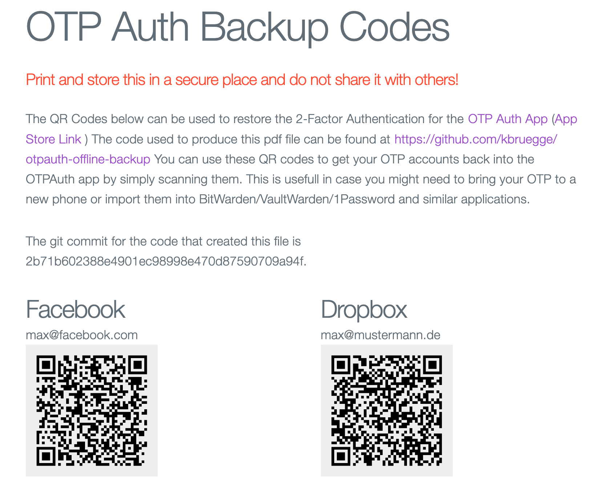

# Offline Backup for OTPAuth

This is a fork from [https://github.com/CooperRS/decrypt-otpauth-files](https://github.com/CooperRS/decrypt-otpauth-files) originally called `decrypt-otpauth-files` by Roland Moers.

This tool uses the encrypted backups/account files created by [OTP Auth for iOS](http://cooperrs.de/otpauth.html) and then stores the relevant QR for recovery  a PDF file for printing. On paper and offline.

I use this printed piece of paper together with some printed out recovery codes from the webservices themselves to make sure I can always access my data if I should lose my phone or worse. I also used this to import OTP codes into BitWarden/VaultWarden etc. others might alos work but have not been tested. 

## Usage

This is a [poetry project](https://python-poetry.org/). Install the project using

```
poetry install
```

or use the provided `requirements.txt` and `pip` to install. There is no executable entry point defined at the moment. Feel free to add a PR.

The __create_recovery.py__ command takes the path to the OTPAuth backup file which you exported from the app and the path to the pdf file to write. You will be prompted to enter your password to decrypt the backed up file.

    Usage: create_recovery.py [OPTIONS] BACKUP_FILE OUTPUT_FILE

    Opens the OTPAuth backup file given by 'BACKUP_FILE' for reading and writes
    QR codes for printing into 'OUTPUT_FILE'. Will prompt for password to
    decrypt the OTPAuth backup file  if not provided via commandline.

    Options:
    --password TEXT
    --help           Show this message and exit.


Create the pdf as seen in `example/example.pdf` with the following command:
```
poetry run python create_recovery.py example/example.otpauthdb example.pdf --password abc123
```

The screenshot below shows a part of the generated PDF.




__Make sure you test the recovery of your OTP tokens__

__Absolutely no warranty for lost accounts__

